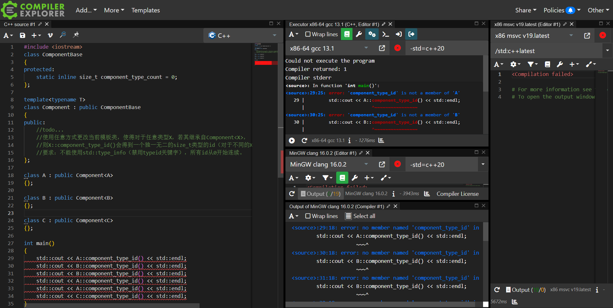

- [Loser-HomeWork](#loser-homework)
  - [`01`实现管道运算符](#01实现管道运算符)
    - [运行结果：](#运行结果)
    - [群友提交](#群友提交)
    - [标准答案](#标准答案)
  - [`02`实现自定义字面量`_f`](#02实现自定义字面量_f)
    - [运行结果:](#运行结果-1)
    - [群友提交](#群友提交-1)
    - [标准答案](#标准答案-1)
  - [`03`实现`print`以及特化`std::formatter`](#03实现print以及特化stdformatter)
    - [运行结果：](#运行结果-2)
    - [群友提交](#群友提交-2)
    - [标准答案](#标准答案-2)
  - [`04`给定模板类修改，让其对每一个不同类型实例化有不同`ID`](#04给定模板类修改让其对每一个不同类型实例化有不同id)
    - [运行结果：](#运行结果-3)
    - [群友提交](#群友提交-3)
    - [标准答案](#标准答案-3)

# Loser-HomeWork

卢瑟们的作业展示

提交`pr`不应当更改当前`README`，请将作业提交到`src\群友提交`中，比如你要提交第一个作业：

你应当在`src\群友提交\第一题`中创建一个自己的`.md`或`.cpp`文件，**文件名以QQ群名命名**。

答题的**一般要求**如下（题目额外要求也自行注意看）：

1. 不更改`main`函数，不得使其不运行（意思别捞偏门）。
2. 自行添加代码，在满足第一点的要求下，要能成功编译运行并与给出运行结果一致。

## `01`实现管道运算符
日期：**`2023/7/21`** 出题人：**`mq白`**

给出代码：
```cpp
int main(){
    std::vector v{1, 2, 3};
    std::function f {[](const int& i) {std::cout << i << ' '; } };
    auto f2 = [](int& i) {i *= i; };
    v | f2 | f;
}
```
### 运行结果：
```
1 4 9
```

难度：**一星**

### 群友提交

答题者：[**`andyli`**](src/群友提交/第一题/andyli.cpp)
```cpp
#include <algorithm>
#include <vector>
#include <functional>
#include <iostream>

template <typename R, typename F>
auto operator|(R&& r, F&& f) {
    for (auto&& x: r)
        f(x);
    return r;
}
int main() {
    std::vector v{1, 2, 3};
    std::function f{[](const int& i) { std::cout << i << ' '; }};
    auto f2 = [](int& i) { i *= i; };
    v | f2 | f;
}
```
>很常规，没啥问题。

答题者：[**`mq松鼠`**](src/群友提交/第一题/mq松鼠.cpp)
```cpp
#include<iostream>
#include <vector>
#include <functional>

auto operator | (std::vector<int>&& v,std::function<void(const int&)> f){
    for(auto&i:v){
        f(i);
    }
    return v;
}
auto operator | (std::vector<int>& v,std::function<void(int&)> f){
    for(auto&i:v){
        f(i);
    }
    return v;
}
int main(){
    std::vector v{1, 2, 3};
    std::function f {[](const int& i) {std::cout << i << '\n'; } };
    auto f2 = [](int& i) {i *= i; };
    v | f2 | f;
}
```
>评价：闲的没事多写个重载，裱起来。

<br>

### 标准答案

```cpp
template<typename U, typename F>
	requires std::regular_invocable<F, U&>//可加可不加，不会就不加
std::vector<U>& operator|(std::vector<U>& v1, F f) {
	for (auto& i : v1) {
		f(i);
	}
	return v1;
}
```
**不使用模板**：
```cpp
std::vector<int>& operator|(std::vector<int>& v1, const std::function<void(int&)>& f) {
	for (auto& i : v1) {
		f(i);
	}
	return v1;
}
```
不使用范围`for`，使用`C++20`简写函数模板：
```cpp
std::vector<int>& operator|(auto& v1, const auto& f) {
	std::ranges::for_each(v1, f);
	return v1;
}
```
**各种范式无非就是这些改来改去了，没必要再写。**

---

<br>

## `02`实现自定义字面量`_f`
日期：**`2023/7/22`** 出题人：**`mq白`**

给出代码：
```cpp
int main(){
    std::cout << "乐 :{} *\n"_f(5);
    std::cout << "乐 :{0} {0} *\n"_f(5);
    std::cout << "乐 :{:b} *\n"_f(0b01010101);
    std::cout << "{:*<10}"_f("卢瑟");
    std::cout << '\n';
    int n{};
    std::cin >> n;
    std::cout << "π：{:.{}f}\n"_f(std::numbers::pi_v, n);
}
```
### 运行结果:
```
乐 :5 *
乐 :5 5 *
乐 :1010101 *
卢瑟******
6
π：3.141593
```
`6`为输入，决定`π`的小数点后的位数，可自行输入更大或更小数字。
提示：`C++11用户定义字面量`，`C++20format库`。
难度：**二星**

### 群友提交

答题者：[**`andyli`**](/src/群友提交/第二题/andyli.cpp)

```cpp
#include <format>
#include <iostream>
#include <string_view>
#include <string>

namespace impl {
    struct Helper {
        const std::string_view s;
        Helper(const char* s, std::size_t len): s(s, len) {}
        template <typename... Args>
        std::string operator()(Args&&... args) const {
            return std::vformat(s, std::make_format_args(std::forward<Args>(args)...));
        }
    };
} // namespace impl
impl::Helper operator""_f(const char* s, std::size_t len) noexcept {
    return {s, len};
}

int main() {
    std::cout << "乐 :{} *\n"_f(5);
    std::cout << "乐 :{0} {0} *\n"_f(5);
    std::cout << "乐 :{:b} *\n"_f(0b01010101);
    std::cout << "{:*<10}"_f("卢瑟");
    std::cout << '\n';
    int n{};
    std::cin >> n;
    std::cout << "π：{:.{}f}\n"_f(std::numbers::pi_v<double>, n);
}
```

<br>

### 标准答案

```cpp
constexpr auto operator""_f(const char* fmt, size_t) {
	return[=]<typename... T>(T&&... Args) { return std::vformat(fmt, std::make_format_args(std::forward<T>(Args)...)); };
}
```

---

<br>

## `03`实现`print`以及特化`std::formatter`
日期：**`2023/7/24`** 出题人：**`mq白`**

实现一个`print`，如果你做了上一个作业，我相信这很简单。
要求调用形式为: 
```cpp
print(格式字符串，任意类型和个数的符合格式字符串要求的参数)
```
```cpp
struct Frac {
   int a, b;
};
```
给出自定义类型`Frace`，要求支持
```cpp
Frac f{ 1,10 };
print("{}", f);// 结果为1/10
```

### 运行结果：

    1/10

禁止面相结果编程，使用宏等等方式，最多`B`（指评价），本作业主要考察和学习`format`库罢了。
提示: **`std::formatter`**
>提交代码最好是网上编译了三个平台的截图，如：


### 群友提交

<br>

### 标准答案

```cpp
template<>
struct std::formatter<Frac>:std::formatter<char>{
	auto format(const auto& frac, auto& ctx)const{//const修饰是必须的
		return std::format_to(ctx.out(), "{}/{}", frac.a, frac.b);
	}
};
void print(std::string_view fmt,auto&&...args){
	std::cout << std::vformat(fmt, std::make_format_args(std::forward<decltype(args)>(args)...));
}
```

我们只是非常简单的支持了**题目要求**的形式，给`std::formatter`进行特化，如果要支持比如那些`{:6}`之类的格式化的话，显然不行，这涉及到更多的操作。
简单的特化以及[`std::formatter`](https://zh.cppreference.com/w/cpp/utility/format/formatter)支持的形式可以参见[**文档**](https://zh.cppreference.com/w/cpp/utility/format/formatter)。
一些复杂的特化，`up`之前也有写过，在[**`Cookbook`**](https://github.com/Mq-b/Cpp20-STL-Cookbook-src#76%E4%BD%BF%E7%94%A8%E6%A0%BC%E5%BC%8F%E5%BA%93%E6%A0%BC%E5%BC%8F%E5%8C%96%E6%96%87%E6%9C%AC)中；里面有对[`std::ranges::range`](https://zh.cppreference.com/w/cpp/ranges/range)，和[`std::tuple`](https://zh.cppreference.com/w/cpp/utility/tuple)的特化，支持所有形式。

---

<br>

## `04`给定模板类修改，让其对每一个不同类型实例化有不同`ID`
日期：**`2023/7/25`** 出题人：**`Maxy`**
```cpp
#include<iostream>
class ComponentBase{
protected:
	static inline size_t component_type_count = 0;
};
template
class Component : public ComponentBase{
public:
    //todo...
    //使用任意方式更改当前模板类，使得对于任意类型X，若其继承自Component

    //则X::component_type_id()会得到一个独一无二的size_t类型的id（对于不同的X类型返回的值应不同）
    //要求：不能使用std::type_info（禁用typeid关键字），所有id从0开始连续。
};
class A : public Component
{};
class B : public Component
{};
class C : public Component
{};
int main()
{
	std::cout << A::component_type_id() << std::endl;
	std::cout << B::component_type_id() << std::endl;
	std::cout << B::component_type_id() << std::endl;
	std::cout << A::component_type_id() << std::endl;
	std::cout << A::component_type_id() << std::endl;
	std::cout << C::component_type_id() << std::endl;
}
```

### 运行结果：

    0
    1
    1
    0
    0
    2
>提交应当给出多平台测试结果，如图：



### 群友提交

<br>

### 标准答案